# 🛍️ Meiduo Mall 美多商城（Django + Vue 全容器化电商项目）


全容器化的 Django + Vue 电商项目模板，支持 Docker Compose、uWSGI、Nginx、Celery、Redis、MySQL、Elasticsearch，并内置 GitHub Actions CI/CD。

---

# 📸 示例截图

请将你的截图放在：

```
docs/images/home.png  
docs/images/goods.png  
```

示例布局：

首页 | 商品详情
---- | ----
 | 

---

# 🧩 技术架构

```mermaid
graph TD
    A["用户浏览器"] -->|"HTTP/HTTPS"| B["Nginx 前端"]
    B -->|"uWSGI"| C["Django 后端"]
    C --> D["MySQL 数据库"]
    C --> E["Redis 缓存"]
    C --> F["Elasticsearch 搜索"]
    C --> G["Celery Worker"]
```



---

# 🚀 功能模块概览

## 电商业务

- 用户系统：注册、登录、邮箱验证  
- 商品分类、SPU、SKU  
- 商品详情页 + 规格切换  
- 购物车（本地存储 + Redis）  
- 订单系统：结算 → 提交 → 回显  
- 支付流程示例（支付宝）  
- 搜索功能（Elasticsearch + drf-haystack）

## 工程能力

- 完整 Docker Compose 部署  
- uWSGI + Nginx 生产模式  
- Celery 异步任务  
- 健康检查 `/healthz/`  
- GitHub Actions 全自动 CI/CD（测试 + 构建镜像）

---

# 🐳 Docker 一键部署

运行：

```bash
bash rebuild_clean.sh
```

脚本内容：

- 停止旧容器  
- 清理 data 挂载数据  
- 重建镜像  
- 启动 MySQL / Redis / ES / Django / Vue  
- Django 自动 migrate + collectstatic  
- 健康检查前后端状态  

完毕后访问：

```
前端：http://localhost:8080
后端：http://localhost:8000
```

---

# 🧪 GitHub Actions（CI/CD）

CI 文件：

```
.github/workflows/ci.yml
```

自动执行：

- Django 单元测试  
- MySQL + Redis 服务启动  
- Docker 镜像构建  
- 推送到 GHCR（GitHub Container Registry）

CI 状态页：
https://github.com/lijiahao1996/meiduo/actions

---

# 📂 项目结构

```bash
meiduo/
├── docker/                   # Docker 构建资源
├── docker-compose.yaml       # 服务编排
│
├── meiduo_mall/              # Django 后端
│   ├── apps/                 # 用户、商品、订单等模块
│   ├── celery_tasks/         # 异步任务
│   ├── settings/             # dev / prod 配置
│   ├── utils/                # 工具库
│   ├── Dockerfile            # 后端镜像构建
│   └── uwsgi.ini             # uWSGI 配置
│
├── meiduo_mall_frontend/     # Vue 前端
│   ├── src/                  # 前端业务代码
│   ├── public/               # 模板
│   ├── nginx.conf            # 前端 Nginx 配置
│   └── Dockerfile            # 前端镜像构建
│
├── rebuild_clean.sh          # 一键部署脚本
├── Jenkinsfile               # CI/CD（可选）
├── LICENSE                   # MIT 协议
└── README.md
```

---

# 🧱 常见问题 FAQ

### ⚠️ 后端 unhealthy？
检查 uWSGI 日志：

```
daemonize = /dev/stdout
```

### ⚠️ Elasticsearch 无搜索结果？
执行：

```bash
docker exec meiduo_server python manage.py rebuild_index
```

### ⚠️ Vue 页面空白？
```bash
cd meiduo_mall_frontend
npm install
npm run build
```

---

# 🙌 Contributing

欢迎提交 Issue / PR。

新功能请创建新分支：

```bash
git checkout -b feature/xxx
```

---

# ⭐ Star 历史

[](https://star-history.com/#lijiahao1996/meiduo)

---

# 📜 License

MIT License  
详见 `LICENSE` 文件。

---

# 👤 Maintainer

**Howell (Li Jiahao)**  
GitHub: https://github.com/lijiahao1996

